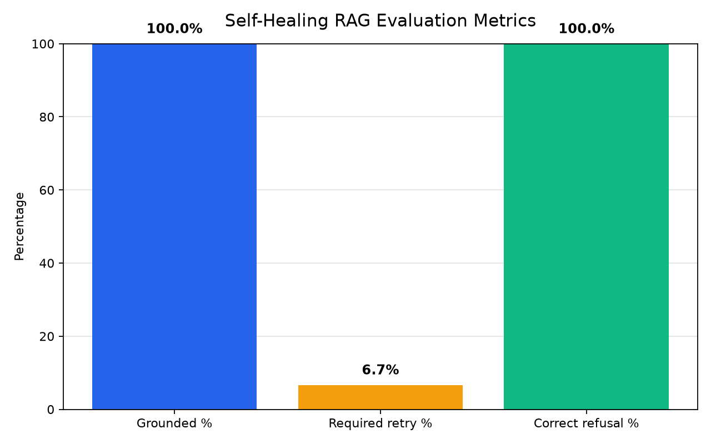

# Self-healing RAG pipeline

A Retrieval-Augmented Generation system that doesn't just retrieve and generate — it critiques its own answers, rewrites the search query, and retries before ever giving up. Built and evaluated end-to-end against National Presto Industries' real FY2025 10-K SEC filing.

## Why this is different from a typical RAG demo

Most RAG tutorials stop at retrieve → generate. This pipeline adds three layers most demos skip entirely:

- **A critic node** that checks whether the generated answer is actually grounded in the retrieved evidence, instead of trusting the model's first attempt.
- **Query rewriting on retry** — if the critic rejects an answer, the system reformulates the search query and tries again (up to 2 retries) rather than repeating the same failed attempt.
- **A scope guardrail** that rejects off-topic questions before wasting a retrieval cycle, instead of running the full pipeline only to land on a generic refusal.
- **A measured evaluation suite** — 15 test questions, run end-to-end, with real grounded/retry/refusal rates, not just "it worked when I tried it."

## Architecture

```
START
  ↓
scope_check ──[out of scope]──> out_of_scope ──> END
  │ [in scope]
  ↓
retriever ──> generator ──> critic
                               │
                ┌──────────────┼──────────────┐
          [grounded]     [not grounded,   [not grounded,
              │           retries left]    retries exhausted]
              ↓                │                │
             END         rewrite_query      fallback ──> END
                                │
                                ↓
                            retriever (loop)
```

**Stack:** Python, LangChain, LangGraph, OpenAI (`gpt-4o-mini` for generation/critique, `text-embedding-3-small` for embeddings), FAISS for local vector storage.

## How it works

1. **Scope check** — a fast classification call decides whether the question is plausibly answerable from this filing at all. Off-topic questions (e.g. "what's a good cookie recipe?") are rejected immediately, before any retrieval happens.
2. **Retrieve** — the question (or a rewritten version, on retry) is embedded and matched against FAISS-indexed chunks of the 10-K.
3. **Generate** — an LLM answers strictly from the retrieved context, explicitly instructed to say "I don't know" rather than guess, and to reason carefully about which fiscal year is most recent when a question uses relative time language like "last year."
4. **Critique** — a second, independent LLM call checks whether the answer is actually supported by the retrieved chunks, and returns a structured verdict with a reason.
5. **Self-heal or stop** — if the critic rejects the answer and retries remain, the query is rewritten based on the critic's specific objection and the loop tries again. If retries run out, the system returns an honest "I don't have enough information" instead of a hallucination.

## Evaluation results

Run against 15 hand-written test questions spanning three categories: direct factual lookups, questions requiring retrieval refinement, and questions the filing genuinely doesn't answer.

| Metric | Result |
|---|---|
| Grounded rate | **100%** |
| Questions requiring at least one retry | 6.7% (1 of 15) |
| Correct refusal rate (should be unanswerable) | **100%** |
| Average latency per question | 4.18s |



### Self-healing in action

The question *"Is Presto facing any major risks?"* is the one case that needed the retry loop. The first two attempts retrieved evidence the critic judged too generic; the system rewrote the query twice, on the third attempt retrieving evidence specific enough about IP protection, EPA environmental listings, and pandemic-related risk to produce a fully grounded answer:

```
Q: Is Presto facing any major risks?

Attempt 1 → query: "Is Presto facing any major risks?"
  critic: rejected — too generic to confirm grounding

Attempt 2 → query: "What are the potential risks and challenges Presto may encounter?"
  critic: rejected — still not specific enough

Attempt 3 → query: "What significant risks and challenges could impact Presto's
                     operations and financial stability?"
  critic: accepted — grounded in IP protection risk, EPA site listing,
                      and pandemic-related operational risk
```

### A bug the eval caught

Early testing surfaced a real failure mode: when asked "how much did Presto earn last year," the generator pulled the wrong column from a multi-year financial table (the oldest year shown, not the most recent). The fix wasn't "tell it to use the right year" — it required explicitly telling the model which column position corresponds to the most recent fiscal year, since table-column reasoning turned out to be a genuine blind spot even with grounding instructions in place.

## Project structure

```
self-healing-rag/
├── data/                 # source 10-K filing
├── faiss_index/          # persisted vector store
├── ingest.py             # chunk, embed, and index the source document
├── nodes.py              # retriever, generator, critic, rewrite, scope-check nodes
├── graph.py              # LangGraph workflow wiring
├── main.py                # interactive CLI
├── eval.py               # 15-question evaluation harness
├── eval_results.json     # raw eval output
└── eval_chart.png        # eval results, visualized
```

## Running it

```bash
pip install -r requirements.txt
cp .env.example .env   # add your OPENAI_API_KEY
python ingest.py       # one-time: build the FAISS index
python main.py         # ask questions interactively
python eval.py         # run the evaluation suite
```

## What I'd build next

- Cache embeddings for repeated questions to cut latency
- Extend the eval set with adversarial/ambiguous questions
- Swap the hardcoded fallback retry count for an adaptive budget based on critic confidence
